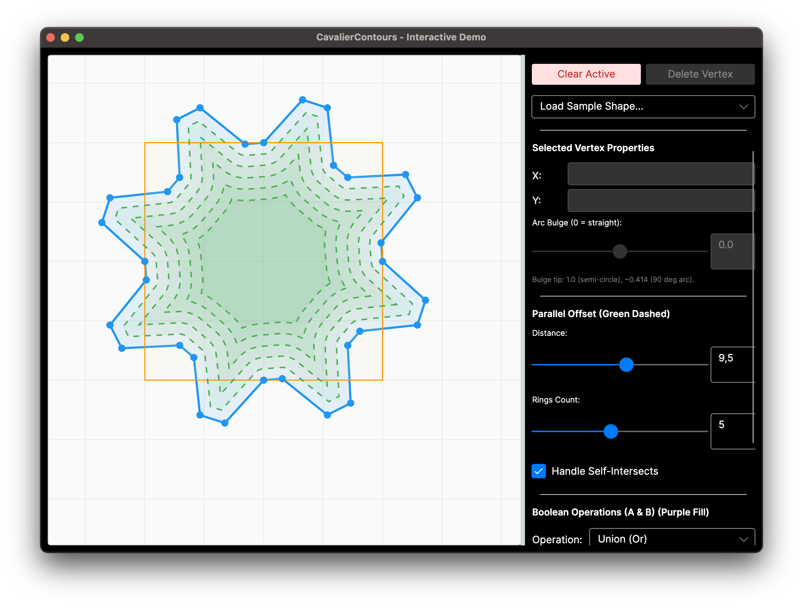
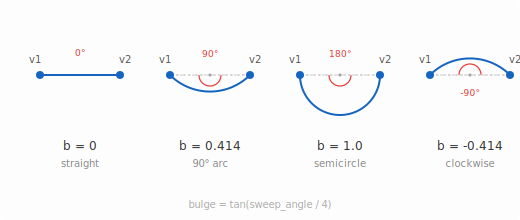

# CavalierContours.NET

A pure C# port of the [cavalier_contours](https://github.com/jbuckmccready/cavalier_contours) Rust library for 2D polyline offsetting and boolean operations, targeting .NET 10+ with full generic math support.



## Features

- **Polylines with arcs**: Vertices carry a _bulge_ value defining circular arc segments (not approximated as line segments)
- **Parallel offset**: Robust polyline offsetting for open, closed, and self-intersecting polylines
- **Boolean operations**: Union, intersection, difference, and XOR between two closed polylines
- **Containment tests**: Determine if one polyline is inside another
- **Winding number**: Fast point-in-polygon test
- **Geometric utilities**: Area, path length, redundant vertex removal, closest point, and more
- **Spatial indexing**: `StaticAABB2DIndex` for accelerated queries on high-vertex-count polylines
- **Generic math**: All algorithms work with any `IFloatingPointIeee754<T>` type (`double`, `float`, etc.)

## Quick Start

### Prerequisites

- [.NET 10 SDK](https://dotnet.microsoft.com/download) or later

### Build

```bash
dotnet build
```

### Run Tests

```bash
dotnet test
```

### Interactive Demo

The `CavalierContours.Example` project is a full-featured interactive application for exploring the library's capabilities in real time.

```bash
dotnet run --project CavalierContours.Example/CavalierContours.Example.csproj
```

## Usage Example

```csharp
using CavalierContours.Polyline;

// Create a closed polyline (circle with radius 1 centered at (1, 0))
var pline = new Polyline<double>(true);
pline.Add(0.0, 0.0, 1.0);  // arc bulge = 1.0 means semicircle
pline.Add(2.0, 0.0, 1.0);

// Compute parallel offset inward by 0.2
var options = new PlineOffsetOptions<double>();
var offsets = PlineOffset.ParallelOffset<Polyline<double>, double>(pline, 0.2, options);

// Compute area and path length
double area = pline.Area();         // ~3.14159 (pi)
double length = pline.PathLength(); // ~6.28318 (2*pi)

// Boolean union of two closed polylines
var boolOptions = new PlineBooleanOptions<double>();
var result = PlineBoolean.PolylineBoolean<Polyline<double>, double>(
    plineA, plineB, BooleanOp.Or, boolOptions);

// Result contains positive (solid) and negative (hole) polylines
foreach (var pos in result.PosPlines) { /* ... */ }
foreach (var neg in result.NegPlines) { /* ... */ }
```

### Bulge values

The bulge on a vertex controls the arc from that vertex to the next.
`0` = straight line, `1` = semicircle, `0.414` = quarter-circle arc.
Positive = counter-clockwise, negative = clockwise. Defined as `tan(sweep_angle / 4)`.



## API Overview

### Core Types

| Type                   | Description                                     |
| ---------------------- | ----------------------------------------------- |
| `Vector2<T>`           | 2D vector with generic math                     |
| `AABB<T>`              | Axis-aligned bounding box                       |
| `Polyline<T>`          | Mutable polyline with vertices and bulge values |
| `PlineVertex<T>`       | Immutable vertex (X, Y, Bulge)                  |
| `StaticAABB2DIndex<T>` | Packed R-tree spatial index                     |

### Polyline Operations

| Method                              | Description                                               |
| ----------------------------------- | --------------------------------------------------------- |
| `PlineOffset.ParallelOffset(...)`   | Compute parallel offset curves                            |
| `PlineBoolean.PolylineBoolean(...)` | Boolean operations (union, intersection, difference, xor) |
| `PlineContains.Contains(...)`       | Containment test between polylines                        |
| `pline.Area()`                      | Signed area of a closed polyline                          |
| `pline.PathLength()`                | Total path length                                         |
| `pline.WindingNumber(point)`        | Winding number for point-in-polygon test                  |
| `pline.RemoveRepeatPos(eps)`        | Remove duplicate consecutive vertices                     |
| `pline.RemoveRedundant(eps)`        | Remove collinear/redundant vertices                       |
| `pline.RotateStart(...)`            | Rotate the starting vertex of a closed polyline           |
| `pline.FindPointAtPathLength(...)`  | Find point at a given distance along the polyline         |
| `pline.CreateApproxAabbIndex()`     | Build a spatial index for accelerated queries             |

## Acknowledgements

This is a C# port of the excellent [cavalier_contours](https://github.com/jbuckmccready/cavalier_contours) Rust library by [Jedidiah Buck McCready](https://github.com/jbuckmccready). The core algorithms for polyline offsetting and boolean operations are based on the original implementation.

## License

This project (CavalierContours.NET) is licensed under the **ISC License**. See [LICENSE](LICENSE) for the full text.

The original [cavalier_contours](https://github.com/jbuckmccready/cavalier_contours) Rust library by Jedidiah Buck McCready is dual-licensed under **MIT** and **Apache-2.0**. The original MIT license and copyright notice are included in the [LICENSE](LICENSE) file as required by the MIT license terms.
