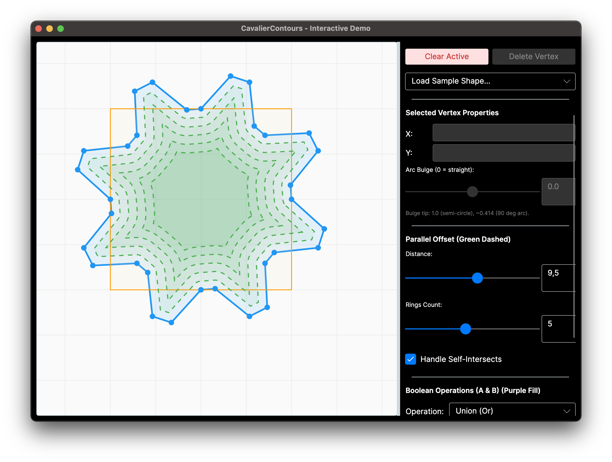
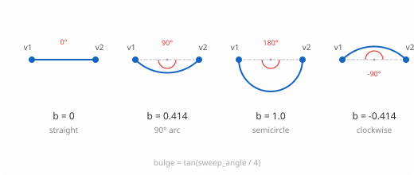

# CavalierContours.NET

[](https://github.com/oberbichler/CavalierContoursNet/actions/workflows/ci.yml)
[](https://www.nuget.org/packages/CavalierContours)
[](https://www.nuget.org/packages/CavalierContours)

A pure C# port of the [cavalier_contours](https://github.com/jbuckmccready/cavalier_contours) Rust library for 2D polyline offsetting and boolean operations. The package targets `net8.0` and `net10.0`.



## Install

```bash
dotnet add package CavalierContours
```

```xml
<PackageReference Include="CavalierContours" Version="*" />
```

## Features

- **Polylines with arcs**: Vertices carry a _bulge_ value defining circular arc segments (not approximated as line segments)
- **Parallel offset**: Robust polyline offsetting for open, closed, and self-intersecting polylines
- **Boolean operations**: Union, intersection, difference, and XOR between two closed polylines
- **Containment tests**: Determine if one polyline is inside another
- **Winding number**: Fast point-in-polygon test
- **Geometric utilities**: Area, path length, redundant vertex removal, closest point, and more
- **Spatial indexing**: `StaticAABB2DIndex` for accelerated queries on high-vertex-count polylines
- **Generic element type**: Everything is generic over `T`, but `double` is the only type that is
  actually supported — see [Generic element type](#generic-element-type)

## Quick Start

### Prerequisites

- [.NET 10 SDK](https://dotnet.microsoft.com/download) — the repository multi-targets `net8.0` and `net10.0`
- The [.NET 8 runtime](https://dotnet.microsoft.com/download/dotnet/8.0), because `dotnet build` and
  `dotnet test` also build and **run** the `net8.0` target. The .NET 10 SDK alone is not enough: a
  `net8.0` test host does not roll forward onto the 10.0 runtime, so `dotnet test` fails with
  `You must install or update .NET to run this application`. To skip that target, run
  `dotnet test --framework net10.0`.

### Build

```bash
dotnet build
```

### Run Tests

```bash
dotnet test
```

### Interactive Demo

The `CavalierContours.Example` project is a full-featured interactive application for exploring the library's capabilities in real time.

The project multi-targets, so a framework has to be selected explicitly:

```bash
dotnet run --project CavalierContours.Example/CavalierContours.Example.csproj --framework net10.0
```

## Usage Example

```csharp
using CavalierContours.Polyline;

// Create a closed polyline (circle with radius 1 centered at (1, 0))
var pline = new Polyline<double>(true);
pline.Add(0.0, 0.0, 1.0);  // arc bulge = 1.0 means semicircle
pline.Add(2.0, 0.0, 1.0);

// Compute area and path length
double area = pline.Area();         // 3.141592653589793 (pi)
double length = pline.PathLength(); // 6.283185307179586 (2*pi)

// Compute parallel offset inward by 0.2, leaving a circle of radius 0.8
var options = new PlineOffsetOptions<double>();
var offsets = PlineOffset.ParallelOffset<Polyline<double>, double>(pline, 0.2, options);
// offsets is List<Polyline<double>>; here one result with area 2.0106192982974678 (pi * 0.8^2)

// Boolean union with a second, overlapping circle
var plineB = new Polyline<double>(true);
plineB.Add(1.0, 0.0, 1.0);
plineB.Add(3.0, 0.0, 1.0);

var boolOptions = new PlineBooleanOptions<double>();
var result = PlineBoolean.PolylineBoolean<Polyline<double>, double>(
    pline, plineB, BooleanOp.Or, boolOptions);
// result.ResultInfo == BooleanResultInfo.Intersected

// Result carries positive (solid) and negative (hole) polylines. Each entry is a
// BooleanResultPline<Polyline<double>, double>, so the polyline itself is `.Pline`.
foreach (var pos in result.PosPlines) { double a = pos.Pline.Area(); }
foreach (var neg in result.NegPlines) { double a = neg.Pline.Area(); }
```

### Bulge values

The bulge on a vertex controls the arc from that vertex to the next.
`0` = straight line, `1` = semicircle, `0.414` = quarter-circle arc.
Positive = counter-clockwise, negative = clockwise. Defined as `tan(sweep_angle / 4)`.



## API Overview

### Core Types

| Type                                     | Description                                     |
| ---------------------------------------- | ----------------------------------------------- |
| `CavalierContours.Core.Vector2<T>`       | 2D vector                                       |
| `CavalierContours.Core.AABB<T>`          | Axis-aligned bounding box                       |
| `CavalierContours.Polyline.Polyline<T>`  | Mutable polyline with vertices and bulge values |
| `CavalierContours.Polyline.PlineVertex<T>` | Immutable vertex (X, Y, Bulge)                |
| `CavalierContours.Spatial.StaticAABB2DIndex<T>` | Packed Hilbert R-tree spatial index      |

The polyline operations below are extension methods on `IPlineSource<T>`
(`CavalierContours.Polyline.PlineSourceExtensions`), so they apply to `Polyline<T>`,
`PlineView<T>` and any other implementation.

### Polyline Operations

| Method                                                     | Description                                                                       |
| ---------------------------------------------------------- | --------------------------------------------------------------------------------- |
| `PlineOffset.ParallelOffset<O, T>(pline, offset, options)`  | Compute parallel offset curves; returns `List<O>`                                 |
| `PlineBoolean.PolylineBoolean<O, T>(p1, p2, op, options)`   | Boolean operations, `BooleanOp.Or` / `And` / `Not` / `Xor`                        |
| `PlineContains.PolylineContains(p1, p2, options)`           | Containment test between polylines; returns `PlineContainsResult`                 |
| `pline.Area()`                                              | Signed area of a closed polyline                                                  |
| `pline.PathLength()`                                        | Total path length                                                                 |
| `pline.WindingNumber(point)`                                | Winding number for point-in-polygon test                                          |
| `pline.ClosestPoint(point, eps)`                            | Closest point on the polyline, or `null` if it has no segment                     |
| `pline.RemoveRepeatPos(eps)`                                | Remove duplicate consecutive vertices; `null` if there was nothing to remove      |
| `pline.RemoveRedundant(eps)`                                | Remove collinear/redundant vertices; `null` if there was nothing to remove        |
| `pline.RotateStart(index, point, eps)`                      | Restart a closed polyline at `point` on segment `index`; `null` on invalid input  |
| `pline.FindPointAtPathLength(length)`                       | Find point at a given distance along the polyline                                 |
| `pline.CreateApproxAabbIndex()`                             | Build a spatial index over the segments from fast, approximate bounding boxes     |
| `pline.CreateAabbIndex()`                                   | Same, but with exact segment bounding boxes                                       |

## Generic element type

Every type is generic over an element type `T`, but the usable range is narrower than the
constraints suggest.

The constraints are not uniform. `Vector2<T>`, `AABB<T>`, `PlineVertex<T>` and `Fuzzy<T>` require
only `T : struct, IFloatingPointIeee754<T>`, while everything that actually does work —
`Polyline<T>`, `StaticAABB2DIndex<T>`, `PlineOffsetOptions<T>`, `PlineBooleanOptions<T>` and hence
`PlineOffset` and `PlineBoolean` — additionally requires `IMinMaxValue<T>`.

More importantly, `Core/Fuzzy.cs` hardcodes one absolute tolerance for every `T`:

```csharp
public static readonly T Epsilon = T.CreateChecked(1e-8);
```

Measured:

| `T`      | `Fuzzy<T>.Epsilon`   | 1 ULP at 1.0 | Consequence                                                     |
| -------- | -------------------- | ------------ | --------------------------------------------------------------- |
| `double` | `1e-8`               | `2.2e-16`    | Works as intended                                                 |
| `float`  | `9.9999999392e-09`   | `1.19e-7`    | Epsilon is below 1 ULP: fuzzy comparisons degenerate to exact equality for magnitudes above about 0.1 |
| `Half`   | `0`                  | `9.8e-4`     | `1e-8` underflows to zero, so `abs(a - b) < 0` is never true and *every* fuzzy predicate is false, even `x.FuzzyEq(x)` |

So:

- **`double` is the supported and tested element type.** The differential fuzz harness described
  below only covers `double`.
- `float` compiles and produces plausible results for well-conditioned inputs, but the tolerance
  based logic (vertex merging, intersection classification, slice stitching) silently stops
  tolerating anything. Not recommended.
- `Half` satisfies the constraints and must not be used.
- `decimal` is rejected at compile time: it does not implement `IFloatingPointIeee754<T>`.

## Upstream parity

This library is a port of [cavalier_contours](https://github.com/jbuckmccready/cavalier_contours) **0.8.0**
and of [static_aabb2d_index](https://github.com/jbuckmccready/static_aabb2d_index) **2.1.0**.

Parity is verified by a differential fuzz harness: both sides generate the same inputs from a
shared deterministic PRNG, and area, path length and extents of every result are compared as raw
IEEE 754 bit patterns. The current corpus is 3000 cases across five geometry classes, each run at
scales x1, x1000 and x0.001, covering 28800 parallel offset calls and 2400 boolean calls. All
113007 compared output lines are identical.

Known differences from upstream `main` (0.9.0), which are **not** ported:

- The parallel offset algorithm was rewritten in 0.9.0 (`RawOffsetBuilder`, topology based
  stitching, `invalid_segments`, `JoinClass`). This port implements the 0.8.0 algorithm.
- `PlineOffsetOptions.SliceJoinEps` was removed in 0.9.0 and replaced by `TouchingLoopBehavior`
  and `CoincidentSegmentBehavior`, so tangential contacts and coincident spans are not
  configurable here.
- Arc segment math (`SegMidpoint`, `SegLength`, `SegClosestPoint`, `SegSplitAtPoint`) became
  chord based in 0.9.0. This port uses the 0.8.0 angle based formulation, which loses accuracy
  for very flat arcs at large radii: for a bulge of 1e-7 across a chord of 1e6 the midpoint is
  off by about 1.5e-4, which exceeds the default position epsilon of 1e-5.
- `pline_seg_intersect.rs` and `pline_intersects.rs` were substantially reworked in 0.9.0.

Missing relative to 0.8.0:

- `scan_for_self_intersect` has no C# equivalent, which leaves `PlineSelfIntersectOptions` and
  `SelfIntersectsInclude` unused.

## Acknowledgements

This is a C# port of the excellent [cavalier_contours](https://github.com/jbuckmccready/cavalier_contours) Rust library by [Jedidiah Buck McCready](https://github.com/jbuckmccready). The core algorithms for polyline offsetting and boolean operations are based on the original implementation.

## License

This project (CavalierContours.NET) is licensed under the **ISC License**. See [LICENSE](LICENSE) for the full text.

The original [cavalier_contours](https://github.com/jbuckmccready/cavalier_contours) Rust library by Jedidiah Buck McCready is dual-licensed under **MIT** and **Apache-2.0**. The original MIT license and copyright notice are included in the [LICENSE](LICENSE) file as required by the MIT license terms.
